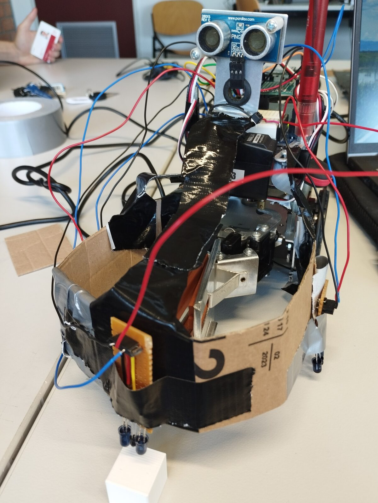
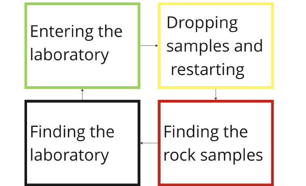

# Venus Exploration: Sputnik-15 Rover

An autonomous exploration rover built for the TU/e first-year design project 5XIB0 (DBL Venus Exploration), Team 23. The task was a simulated Venus surface: the rover has to drive around an arena on its own, find rock samples, pick them up, avoid the mountains and the arena edges, then locate a laboratory and drop the samples off before repeating. All of this runs on a single Arduino Uno with no remote control.

<p align="center">
  
</p>

## What it does

The control loop is a function-based state machine written in C++ (PlatformIO). The rover drives forward by default and reacts to what its sensors report:

- A Parallax PING ultrasonic sensor on a servo detects the mountains (obstacles) ahead. It sweeps across roughly a 105 degree arc and converts echo time to distance using the speed of sound. When something is too close, the rover backs up and turns away.
- Five downward-facing infrared sensors read the floor. The two outer sensors detect the arena border and ramp edges so the rover turns back before driving off. The front and front-side sensors detect rock samples on the ground.
- When a rock sample is found, a servo gripper closes on it and the rover switches into delivery mode.
- The laboratory is marked by a 38 kHz infrared beacon. The rover carries a matched IR receiver, so once it is carrying a sample it rotates until the beacon is in sight, drives toward the lab, and releases the sample.

The strategy is organized as a loop over four phases:

<p align="center">
  
</p>

## Repository structure

```
src/main.cpp              main control loop and pin definitions
lib/drv_movement/         drive, turn and gripper control (two servos + gripper servo)
lib/drv_ultrasound/       PING obstacle detection
lib/drv_infrared/         floor IR sensors: border, ramp and rock-sample detection
lib/drv_labratory/        IR beacon detection for locating the laboratory
lib/emitter/              38 kHz IR beacon signal generation
platformio.ini            Arduino Uno / PlatformIO build configuration
Final_Report_5XIB0.pdf    full project report
Design_Report_5XIB0.pdf   design report
```

Beyond the required sub-modules, the team also explored a camera-based approach: a Raspberry Pi with OpenCV detecting the arena boundary and ArUco markers. It sat outside the assignment rules, so it was kept as an optional extra rather than the main strategy.

## Building and uploading

The firmware is a PlatformIO project targeting the Arduino Uno.

```sh
pio run                 # build
pio run -t upload       # flash to the board
pio device monitor      # serial output at 9600 baud
```

## Video demo

https://drive.google.com/file/d/1DrIZ6RyEy8R6ePMGJqzO0qV9FSID_uZW/view?usp=drive_link

## Technologies

C++, Arduino (Uno), PlatformIO, servo motors, ultrasonic and infrared sensing. The optional camera sub-module used Python, OpenCV and ArUco markers on a Raspberry Pi.

## Team 23

Adam Lasota, Ana Sirbu, Bastiaan Schaap, Daniel Tyukov, Jiahui Que, Ioanna Panagiotopoulou, Malik Weren, Martijn Oosterhuis, Stefano Bracciali, Steven Zollinger.
